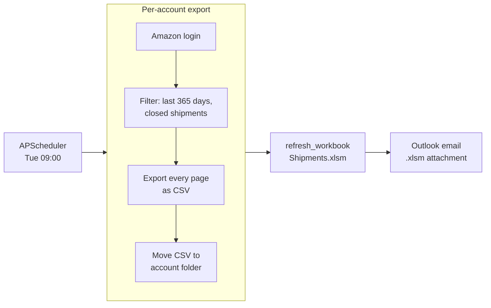

# amzn-shipments

Weekly ETL that pulls FBA shipment data from each Amazon Seller Central account, drops it as per-account CSVs that the connected workbook reads via Power Query, refreshes the workbook synchronously, and emails it. Runs **Tuesday 09:00 local** via APScheduler.

## Weekly flow

1. **Per-account scrape** — for each Amazon account, log into Seller Central and pull the FBA shipment data.
2. **CSV drop** — write the data as per-account CSVs that the connected workbook reads via Power Query.
3. **Refresh + email** — refresh the workbook synchronously and email the refreshed workbook via Outlook.

## Architecture



## Performance notes

A CSV-export ETL whose Excel side stays unattended:

- **Synchronous Power Query refresh.** `refresh_workbook(path, wait=0)` runs
  `modUtilities.refresh` so the workbook picks up the freshly-exported CSVs
  without the script sleeping on an async refresh.
- **CSV-as-data-source.** Each page of the shipments table is exported to a
  per-account CSV that the workbook reads via Power Query — Python never
  touches workbook cells directly.
- **Fail-fast on missing UI.** When the date/status filter controls don't
  appear, the script writes a debug screenshot via `save_debug_screenshot`
  and aborts with a clear error rather than scraping garbage.
- **Version-controlled VBA.** The `modUtilities.refresh` sub lives in
  `vba/modUtilities.bas`.

## Logging

```text
09:00:05 INFO     Navigating to AccountKeyA account.
09:00:31 INFO     Downloading file.
09:00:48 INFO     File 1234567890Z.csv downloaded.
09:02:10 INFO     Updating queries in the Shipment workbook.
09:02:39 INFO     Email has been sent.
```

Configured once via the shared helper:

```python
from seller_automation_utils.logging_utils import setup_logging
log = setup_logging("amzn_shipments")
```

`setup_logging` wires a Rich console handler (colorized output, markup
rendering, rich tracebacks) and a 1 MB rotating file handler writing to
`logs/amzn_shipments.log`. Available to every automation that imports
`seller_automation_utils`.

## Project layout

```
amzn-shipments/
├── run_amzn_shipments.py       # Single-file entry — scrape + refresh + email
├── config/
│   ├── accounts.json           # Amazon account names + Seller Central URLs (gitignored)
│   ├── accounts.json.example   # Template
│   ├── paths.json              # Workbook + downloads paths (gitignored)
│   └── paths.json.example      # Template
├── vba/
│   └── modUtilities.bas        # Version-controlled VBA — synchronous `refresh` sub
├── logs/                       # Rotating log files (gitignored)
├── screenshots/                # Debug screenshots written on browser errors (gitignored)
├── output/                     # Future use; currently empty (gitignored)
├── requirements.txt
├── LICENSE
└── README.md
```

## Setup

### 1. Clone and create the venv

```powershell
git clone https://github.com/dominicci13/amzn-shipments.git
cd amzn-shipments
py -3.12 -m venv .venv
.venv\Scripts\pip install -r requirements.txt
.venv\Scripts\pip install git+https://github.com/dominicci13/shared-python-utils.git
```

### 2. Configure

```powershell
copy .env.example .env
copy config\accounts.json.example config\accounts.json
copy config\paths.json.example config\paths.json
```

Edit each file with real values. All three are gitignored.

### 3. VBA module (one-time per workbook)

`Shipments.xlsm` must contain the canonical `modUtilities` from `vba/modUtilities.bas`. Open the workbook in Excel, press **Alt+F11**, insert a module named `modUtilities`, and paste the contents of `vba/modUtilities.bas`. Save the workbook.

### 4. Run

```powershell
.venv\Scripts\python run_amzn_shipments.py
```

The script prompts "Run now?" — answer **Y** to execute immediately, or **N** to register the APScheduler job and idle until the next **Tue 09:00** trigger.

## Environment variables

| Variable | Description |
|---|---|
| `AMZN_email` | Amazon Seller Central login email |
| `AMZN_pass` | Amazon Seller Central password |
| `CHROME_USER_DATA_DIR` | Path to Chrome automation profile directory |
| `ALERT_EMAIL` | Outlook recipient for unhandled-exception crash reports |
| `SENDER_EMAIL` | Outlook account used to send the report email |
| `TO_EMAIL` | Comma-separated list of recipient email addresses |
| `CC_EMAIL` | Optional comma-separated list of CC email addresses |

## Author

Built by **Brian Ramirez** ([@dominicci13](https://github.com/dominicci13)) — automation & AI workflow specialist. More on my [GitHub profile](https://github.com/dominicci13) and [LinkedIn](https://linkedin.com/in/bdramirez).

## License

[MIT](LICENSE)
